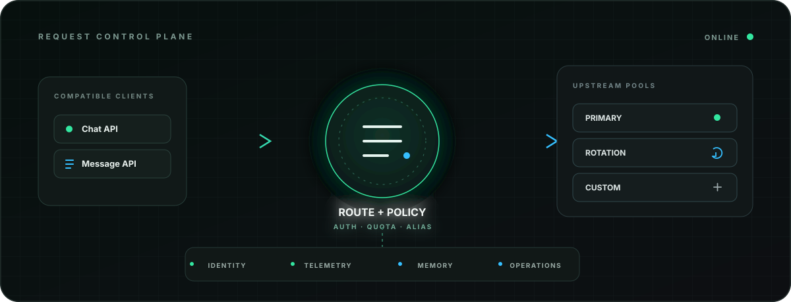
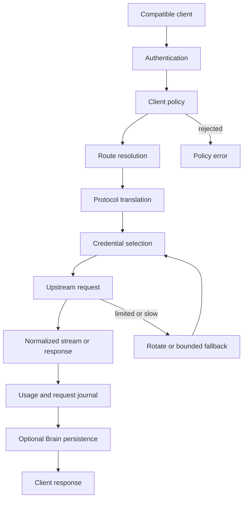

<p align="center">
  
</p>

<h1 align="center">CustoRouter</h1>

<p align="center">
  A self-hosted AI gateway for compatible APIs, access policy, credential rotation, live operations, and searchable memory.
</p>

<p align="center">
  <a href="DOCUMENTATION.md">Documentation</a> ·
  <a href="docs/ARCHITECTURE.md">Architecture</a> ·
  <a href="docs/API_REFERENCE.md">API</a> ·
  <a href="docs/OPERATIONS.md">Operations</a> ·
  <a href="docs/SECURITY.md">Security</a>
</p>

> [!CAUTION]
> This gateway handles paid credentials, client access keys, prompts, responses, usage records, and persistent memory. Never commit secrets, production exports, TLS private keys, or request logs. Review [Security](docs/SECURITY.md) before public deployment.

## Overview

CustoRouter exposes OpenAI-compatible and Anthropic-compatible request surfaces through one FastAPI service. A request is authenticated, checked against its client policy, mapped to the correct upstream connection, translated when required, and recorded for operations. Streaming text, reasoning events, and tool calls remain compatible with the calling protocol.

The live upstream inventory is dynamic. Clients discover what is available through `GET /v1/models`; this README intentionally does not publish provider or model lists that can become stale.

## Core capabilities

| Control plane | What it does |
| --- | --- |
| Compatible APIs | Accepts common chat, message, model-list, token-count, streaming, and tool-call formats |
| Client policy | Applies expiry, quota, allowlist, aliases, and system instructions per client key |
| Routing | Resolves each model identifier to a built-in or database-configured upstream |
| Resilience | Rotates limited credentials, applies cooldowns, detects slow responses, and uses bounded fallback |
| Operations | Provides live activity, request history, key state, routing statistics, configuration, and a playground |
| Brain | Stores client-scoped conversations, decisions, facts, profiles, summaries, and semantic retrieval |

## Architecture at a glance



Brain work is best effort on the inference path. A Brain failure does not replace a successful upstream response. Direct custom-upstream dispatch currently has incomplete Brain coverage; the boundary is documented in [Architecture](docs/ARCHITECTURE.md).

## Request surfaces

| Surface | Primary path | Authentication |
| --- | --- | --- |
| Model discovery | `GET /v1/models` | Router client key |
| OpenAI-compatible chat | `POST /v1/chat/completions` | Router client key |
| Anthropic-compatible messages | `POST /v1/messages` | Router client key |
| Token count | `POST /v1/messages/count_tokens` | Router client key |
| Brain status | `GET /brain/health` | Public health route |
| Brain records and search | `/brain/*` | Router password boundary and key-derived scope |
| Operator dashboard | `/dashboard` | Admin session |
| Live operator events | `/api/sse` | Admin session |

Compatibility aliases and all administrative endpoints are listed in the [API reference](docs/API_REFERENCE.md).

## Client access policy

Inference accepts `Authorization: Bearer <key>` or `x-api-key: <key>`. A managed key can define:

- expiration time;
- total token quota and usage;
- allowed model identifiers;
- client-specific aliases;
- system instructions for selected identifiers.

Policy is applied before an upstream credential is used. Aliases resolve before routing, so a stable client-facing name can move without exposing internal upstream details.

## Brain memory

Brain groups data by a hash derived from the supplied client credential. It can retain conversation context, decisions, facts, session summaries, and profile information, then retrieve relevant records semantically. Raw client credentials are not used as Brain record identifiers.

The direct Brain API currently uses the configured router password check instead of the full managed-key validator. Do not expose Brain routes broadly until this boundary matches the intended deployment policy. See [Brain integration](BRAIN_INTEGRATION.md) and [Security](docs/SECURITY.md).

## Operator dashboard

The dashboard provides:

- live request activity through SSE;
- request status, latency, usage, and routing history;
- provider credential state and cooldown controls;
- custom upstream and model configuration;
- client key policy management;
- routing statistics and Brain monitoring;
- an authenticated chat playground.

The dashboard is an administrative surface. Place it behind TLS and a trusted network or identity-aware proxy.

## Quick start

### Requirements

- Docker Engine and Docker Compose
- PostgreSQL through the included Compose service or an external database
- a completed `.env` based on `.env.example`
- at least one upstream credential
- a strong admin password hash and session secret

```bash
cp .env.example .env
docker compose up -d --build
curl --fail http://localhost:4000/brain/health
```

Open `http://localhost:4000/login` for the operator interface. Verify an authenticated model listing before sending inference traffic.

The Compose file references an optional sibling build context at `../copilot-api`. That directory is not included in this checkout. Restore the sibling service or remove it through a local Compose override before starting the complete stack.

## Example requests

OpenAI-compatible:

```bash
curl http://localhost:4000/v1/chat/completions \
  -H "Authorization: Bearer $ROUTER_API_KEY" \
  -H "Content-Type: application/json" \
  -d '{
    "model": "<model-id>",
    "messages": [{"role": "user", "content": "Check the gateway."}],
    "stream": false
  }'
```

Anthropic-compatible:

```bash
curl http://localhost:4000/v1/messages \
  -H "x-api-key: $ROUTER_API_KEY" \
  -H "anthropic-version: 2023-06-01" \
  -H "Content-Type: application/json" \
  -d '{
    "model": "<model-id>",
    "max_tokens": 256,
    "messages": [{"role": "user", "content": "Check the gateway."}]
  }'
```

Discover valid identifiers from the authenticated model-list endpoint rather than copying a value from documentation.

## Configuration map

| Area | Source of truth |
| --- | --- |
| Process and database settings | `.env` and `app/config.py` |
| Built-in routing behavior | proxy and service modules under `app/` |
| Custom upstreams and client keys | PostgreSQL, managed through the dashboard |
| Container topology | `docker-compose.yml` |
| Image runtime and health check | `Dockerfile` |
| Dashboard interface | `templates/` and `static/` |

Detailed environment, deployment, backup, recovery, and incident procedures live in [Operations](docs/OPERATIONS.md).

## Persistence

PostgreSQL is authoritative for credentials and routing controls, managed client keys, request telemetry, playground sessions, and Brain memory. Application startup creates compatible schema objects. Back up the database before upgrades or bulk configuration changes.

Exports and logs can contain secrets or sensitive prompt data. Store them encrypted, restrict access, and redact them before sharing.

## Production checklist

- replace every example and fixed credential;
- remove or privately bind the published PostgreSQL port;
- terminate TLS at a maintained reverse proxy;
- restrict dashboard and Brain access;
- configure streaming-aware timeouts and request-size limits;
- establish log retention, backup, restore, and key-rotation procedures;
- test one bounded request for each active upstream route;
- monitor health outside the application itself.

The included Compose file currently publishes PostgreSQL on host port `5432` and contains a fixed database password. It must be hardened before public deployment.

## Repository map

```text
app/
  main.py                 Startup and router assembly
  routers/                Proxy, admin, playground, and Brain routes
  services/               Dispatch, adapters, translation, and Brain services
  database.py             PostgreSQL access and schema setup
templates/                Operator pages
static/                   Dashboard browser assets
docs/                     Architecture, API, operations, and security
docker-compose.yml        Service topology
Dockerfile                Application image
```

## Validation

```bash
python -m compileall app
```

`test_brain_integration.py` requires PostgreSQL and the local embedding runtime. Provider integration checks can consume quota, so use dedicated test credentials and a non-production database.

## Documentation

Start with [DOCUMENTATION.md](DOCUMENTATION.md). It links the architecture, complete route inventory, operations handbook, security posture, and Brain implementation notes.

## Credits and license

Built with Python, FastAPI, Uvicorn, PostgreSQL, asyncpg, HTTPX, FastEmbed, NumPy, bcrypt, Jinja, and Docker. Project names and trademarks belong to their respective owners.

No public license is included. Source availability does not grant permission to copy, modify, redistribute, host, or create derivative works.
