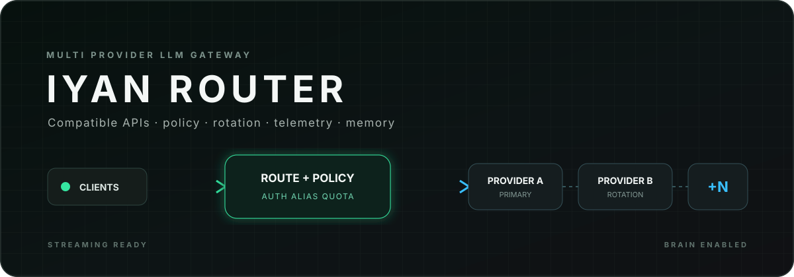
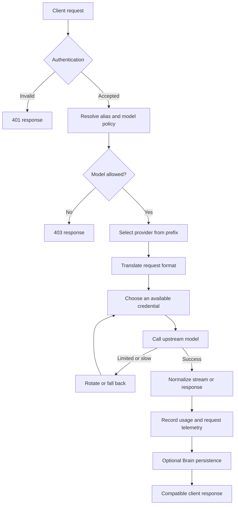

# Iyan Router

<p align="center">
  
</p>

<p align="center">
  <strong>One compatible endpoint for multiple model providers, client policies, live operations, and searchable AI memory.</strong>
</p>

<p align="center">
  
  
  
  
  
</p>

> [!CAUTION]
> This repository operates a credentialed gateway to paid or quota-limited AI services. A public source tree does not grant permission to reuse the code. Never commit provider keys, router client keys, session secrets, database credentials, exports, or production logs.

Iyan Router is a self-hosted LLM gateway with OpenAI-compatible and Anthropic-compatible entry points. It selects a provider from the requested model prefix, applies client-specific model rules, rotates credentials when a provider is limited or slow, streams tool calls and reasoning fields, records operational telemetry, and optionally stores searchable conversation memory in Brain.

[Documentation index](DOCUMENTATION.md) | [Architecture](docs/ARCHITECTURE.md) | [API reference](docs/API_REFERENCE.md) | [Operations](docs/OPERATIONS.md) | [Security](docs/SECURITY.md)

## What it provides

| Area | Capability |
| --- | --- |
| Compatible inference | OpenAI chat completions and Anthropic messages, including streaming and tool calls |
| Provider routing | Built-in provider prefixes plus database-defined custom providers |
| Resilience | Key rotation, cooldowns, slow-response rotation, and bounded provider fallback |
| Client policy | Expiry, token quota, model allowlist, aliases, and per-model system prompts |
| Operations | Dashboard, request logs, live SSE activity, key inventory, model controls, and playground |
| Brain | API-key-scoped conversations, semantic search, facts, decisions, profiles, and summaries |

## How a request moves through the router



The request path is deterministic until provider selection. Brain persistence is intentionally outside the critical response path, so a Brain failure does not break an otherwise valid inference response. Some direct custom-provider paths currently bypass Brain persistence; see [Architecture](docs/ARCHITECTURE.md).

## Public model namespaces

Model identifiers use a prefix to select a provider family. The live list is returned by `GET /v1/models`; avoid hardcoding a model count because provider inventories change.

| Prefix | Provider family |
| --- | --- |
| `bm/` | BluesMinds |
| `nry/` | byNara |
| `dh/` | Dahl |
| `qc/` | Qwen Cloud |
| `mk/` | MarketKu |
| Configured prefix | Custom provider stored in PostgreSQL |

## Quick start

### Requirements

- Docker Engine with Docker Compose
- A populated `.env` based on `.env.example`
- At least one usable upstream provider credential
- A strong admin password hash and session secret

```bash
cp .env.example .env
docker compose up -d --build
curl http://localhost:4000/brain/health
```

The Compose file also references an optional sibling build context at `../copilot-api`. That directory is absent from this checkout. Restore that sibling project or remove the optional service before running the full Compose stack.

Open `http://localhost:4000/login` for the operator dashboard. Production access should terminate TLS at a reverse proxy and restrict the dashboard to trusted operators.

### OpenAI-compatible request

```bash
curl http://localhost:4000/v1/chat/completions \
  -H "Authorization: Bearer $ROUTER_API_KEY" \
  -H "Content-Type: application/json" \
  -d '{
    "model": "qc/model-name",
    "messages": [{"role": "user", "content": "Explain this request path."}],
    "stream": false
  }'
```

### Anthropic-compatible request

```bash
curl http://localhost:4000/v1/messages \
  -H "x-api-key: $ROUTER_API_KEY" \
  -H "anthropic-version: 2023-06-01" \
  -H "Content-Type: application/json" \
  -d '{
    "model": "qc/model-name",
    "max_tokens": 512,
    "messages": [{"role": "user", "content": "Summarize the system."}]
  }'
```

## Client keys and policy

Inference accepts either `Authorization: Bearer <key>` or `x-api-key: <key>`. Managed client keys can carry:

- an expiration time;
- a total token quota and current consumption;
- an allowlist of models;
- per-key model aliases;
- per-model system prompts.

Aliases are resolved before provider routing. Prompts and allowlists therefore follow the resolved model identity. The administrator dashboard is a separate session-based trust boundary.

## Brain memory

Brain stores conversations, decisions, facts, and profiles under a hash of the authenticated client key. Semantic search uses local embeddings through FastEmbed with `all-MiniLM-L6-v2`. This keeps memory retrieval scoped per client while avoiding storage of the raw router key in Brain records.

Brain health is public at `GET /brain/health`. Search and write routes apply the Brain router password check and derive their data scope from the supplied Bearer or `x-api-key` value. See the security note in the [API reference](docs/API_REFERENCE.md) before exposing these routes.

## Data model

PostgreSQL persists provider credentials and controls, managed router keys, request logs, dashboard configuration, playground conversations, and Brain memory. The primary tables include:

`api_keys`, `router_api_keys`, `custom_providers`, `disabled_providers`, `request_logs`, `server_config`, `chat_sessions`, `chat_messages`, `brain_conversations`, `brain_decisions`, `brain_facts`, and `brain_profiles`.

Schema creation and compatible upgrades run during application startup. Back up the database before upgrading or changing provider configuration.

## Operations and current limitations

- `/brain/health` is the container health endpoint.
- A background loop revisits limited keys every 60 seconds and resets keys whose cooldown has elapsed.
- Request logs and SSE events power the live dashboard.
- Provider and model totals are runtime values, so this documentation does not publish static counts.
- The included Compose file exposes PostgreSQL on host port `5432` and contains a fixed database password. Change the password and bind PostgreSQL privately before internet deployment.
- The login limiter is process-local. Multiple application replicas require a shared rate-limit store at the proxy or application layer.
- No repository-wide automated test suite currently covers every provider adapter.

Read [Operations](docs/OPERATIONS.md) before deployment and [Security](docs/SECURITY.md) before exposing any route publicly.

## Validation

Run the static Python check without contacting providers:

```bash
python -m compileall app
```

The Brain integration script requires PostgreSQL and the embedding runtime:

```bash
python test_brain_integration.py
```

Provider integration checks can consume quota and may write request logs. Use dedicated test keys and a non-production database.

## Credits

Iyan Router is built with [Python](https://www.python.org/), [FastAPI](https://fastapi.tiangolo.com/), [Uvicorn](https://www.uvicorn.org/), [PostgreSQL](https://www.postgresql.org/), [asyncpg](https://github.com/MagicStack/asyncpg), [HTTPX](https://www.python-httpx.org/), [FastEmbed](https://github.com/qdrant/fastembed), [NumPy](https://numpy.org/), [bcrypt](https://github.com/pyca/bcrypt/), [Jinja](https://jinja.palletsprojects.com/), and [Docker](https://www.docker.com/). Upstream model and provider names remain the property of their respective owners.

## License

No public license is currently included. Copyright remains with the repository owner. Source availability alone does not grant rights to copy, modify, redistribute, host, or create derivative works.
