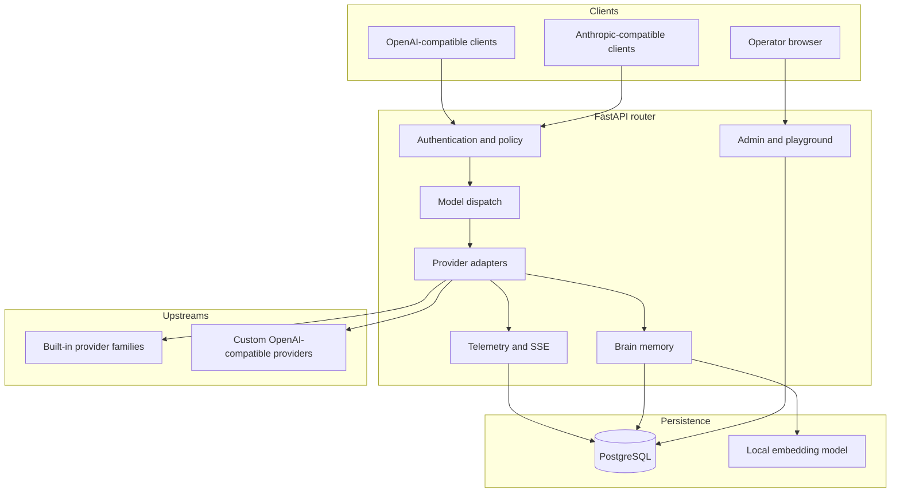

# Architecture

## System context

## Runtime components

`app/main.py` initializes PostgreSQL, loads runtime state, registers routers, mounts static files, and starts the limited-key reset loop. FastAPI serves inference and operator traffic from the same process.

The proxy route accepts both API dialects. Translation services normalize messages, tools, tool results, streaming deltas, reasoning fields, token usage, and errors around provider-specific transports.

Provider dispatch uses a model prefix. Built-in prefix families are implemented in code. Custom providers, their prefixes, base URLs, credentials, and model definitions are stored in PostgreSQL.

## Request lifecycle

1. Read a Bearer token or `x-api-key` header.
2. Validate the managed client key or legacy global router credential.
3. Reject expired or exhausted keys.
4. Resolve the client-scoped model alias.
5. Enforce the model allowlist and apply a configured system prompt.
6. Select the built-in or custom provider from the model prefix.
7. Translate the request into the provider protocol.
8. Select an available provider credential.
9. Forward the request and stream or collect the response.
10. Rotate on rate limiting or configured slow responses where supported.
11. Normalize the response and usage fields.
12. Store request telemetry and update client quota consumption.
13. Store Brain context when the dispatch path supports it.

## Authentication boundaries

Inference clients authenticate with managed router keys or the legacy global router credential. Brain stores a hash of the supplied Bearer or `x-api-key` value as its owner identifier. Raw keys are not used as Brain record keys. The direct Brain routes currently check the configured global router password rather than calling the managed client-key validator, which is a security boundary operators must account for.

Dashboard users authenticate with the configured admin username and a bcrypt password hash. Successful login creates an `HttpOnly`, `Secure`, `SameSite=Strict` session cookie. The session secret signs the cookie state.

Provider credentials are a separate trust domain. They authorize outbound calls and must never be returned by public APIs or written into documentation and logs.

## Provider resilience

Credential state supports rotation and a limited cooldown. The background reset loop runs every 60 seconds and returns eligible credentials to service after their cooldown. Slow upstream responses can trigger rotation when they exceed `SLOW_RESPONSE_THRESHOLD_MS`. Certain built-in providers define an explicit fallback sequence; custom providers use bounded failure handling.

These controls improve availability but cannot guarantee success. An upstream outage, depleted account, incompatible payload, or unavailable model can still fail the request.

## Streaming and tools

The transport layer keeps a client connection open while parsing provider events. Translators preserve text, reasoning, tool names, tool identifiers, and incremental JSON arguments. A provider adapter must emit valid events in the protocol requested by the client.

Disconnects should stop upstream work where the provider transport supports cancellation. Logs must avoid storing secret headers or unbounded sensitive prompt content.

## Brain

Brain provides:

- conversation and message persistence by client-key hash and session;
- semantic retrieval through local embeddings;
- decisions with status and outcome fields;
- structured facts;
- a per-client profile;
- session summaries and monitoring data.

Brain work is best effort on the inference path. A database or embedding failure is recorded but does not replace a successful model response. Direct custom-provider dispatch currently returns before the built-in Brain integration hook, so maintainers should treat custom-provider memory coverage as incomplete until that path is unified.

## Persistence

PostgreSQL is the authoritative store for runtime keys, provider configuration, request telemetry, playground sessions, and Brain memory. Application startup creates missing compatible schema objects. This is convenient for a single-host deployment but is not a substitute for versioned, reversible database migrations.

Exports and database dumps can contain credentials, prompts, responses, and operational identifiers. Handle them as secrets.

## Failure boundaries

| Failure | Expected behavior |
| --- | --- |
| Invalid client key | Request rejected before dispatch |
| Expired or exhausted client key | Request rejected before provider use |
| Disallowed model | Policy rejection |
| Provider credential limited | Credential rotation or cooldown |
| Provider family unavailable | Configured fallback where implemented, otherwise error |
| Brain unavailable | Inference can succeed, Brain write or search reports failure |
| PostgreSQL unavailable at startup | Application cannot initialize normally |
| SSE client disconnect | Dashboard stream ends without stopping the router |

## Extension rules

Add a provider through the existing adapter and prefix patterns. Preserve both API dialects, tool semantics, streaming behavior, request logging, quota accounting, and secret redaction. Custom providers are suitable for compatible endpoints that do not require a new protocol translation layer.
